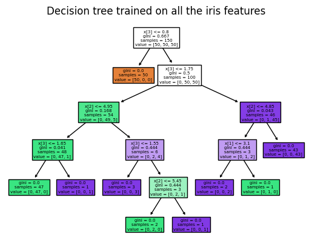
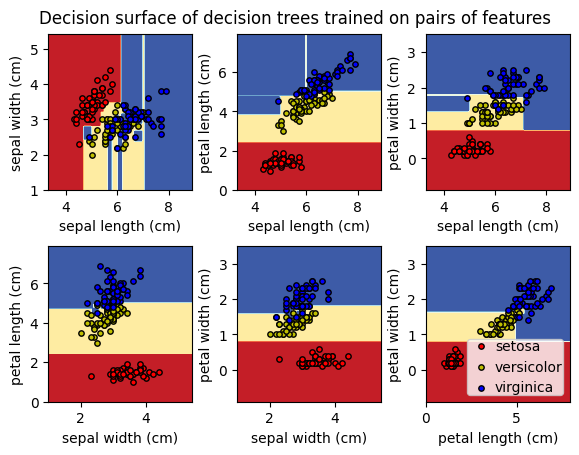
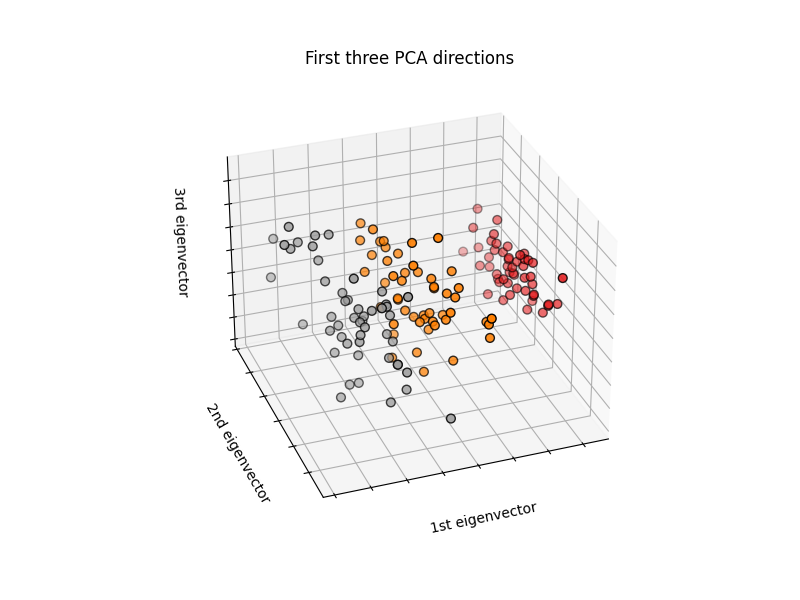

# Zero Knowledge Decision Tree Prediction (ZK-DTP)

## Track
RISC Zero bounty 1

## Problem Statement
In today's digital era, machine learning has become an essential tool for solving complex problems and making data-driven decisions. However, using ML models for sensitive applications can lead to privacy concerns and the potential for data leakage. This becomes especially challenging when the ML model provider needs to offer predictions without disclosing their proprietary model's critical attributes and thresholds. Traditional approaches for sharing ML models expose these sensitive details, making it difficult to strike a balance between functionality and privacy.

## Solution

Zero-KnowLedge Decision Tree Prediction (ZK-DTP) is designed to address this pressing issue by offering privacy-preserving predictions using decision tree models, built on top of RISC Zero's zkVM technology. ZK-DTP enables ML model providers to generate accurate predictions without revealing any sensitive information about the model or the input data.

## System Architecture
```
+---------------------+      +-------------------+      +------------------+      +-------------------+
| Iris dataset        | ---> | Preprocessing and | ---> | Scikit-learn     | ---> | Decision tree     |
|                     |      | feature extraction|      | library          |      | model             |
+---------------------+      +-------------------+      +------------------+      +-------------------+
                |---------------------------------------------------------------------------|
                |                                                                          
                |            +-------------------+      +------------------+      +-------------------+
                |            | Rust code         | ---> | Rust code        | ---> | RISC Zero guest   |
                |----------> | converter         |      | (converted model)|      |                   |
                             +-------------------+      +------------------+      +-------------------+
                                                                                           |
                                                                                           |
+---------------------+      +-------------------+      +------------------+               |
|  Files and receipts | <--- | Proofs generation | <--- | Zero-knowledge   |               |
|                     |      |                   |      | virtual machine  | <------------ |
|                     |      |                   |      | (zkVM)           |
+---------------------+      +-------------------+      +------------------+


```

## Use Cases

ZK-DTP can be employed in a wide range of applications and industries that require secure and privacy-preserving predictions. Some examples include:

Healthcare: Safeguard patient privacy while enabling healthcare providers to make data-driven decisions based on ML models. ZK-DTP ensures that personal health information (PHI) and model details are kept confidential, improving patient trust and compliance with data protection regulations.

Finance: Enhance security and compliance for financial institutions by enabling them to utilize ML models for tasks like credit scoring, fraud detection, and portfolio management, without disclosing sensitive customer data or proprietary model information.

Human Resources: Streamline the recruitment process by using ZK-DTP to analyze candidate profiles without exposing personal information or revealing details of the underlying ML model, thereby preserving privacy and reducing potential bias.

Marketing: Leverage customer data for targeted advertising and personalization without compromising user privacy or revealing proprietary ML model features, enabling a better balance between effective marketing and data protection.

Smart Cities: Utilize ZK-DTP to make data-driven decisions for urban planning, resource management, and environmental monitoring, while ensuring the confidentiality of sensitive data and the underlying ML models.

## Benefits

ZK-DTP revolutionizes the way ML models are used in sensitive applications by offering the following advantages:

Privacy-Preservation: Protects the confidentiality of sensitive model attributes and thresholds, as well as input data, ensuring privacy for both model providers and data owners.

Trustworthy Predictions: Employs Zero-Knowledge Proofs to validate predictions without exposing any confidential information, creating a secure and reliable solution for all parties involved.

Ease of Integration: Built on top of RISC Zero's zkVM, ZK-DTP seamlessly integrates with existing systems and benefits from the platform's advanced capabilities, ensuring a smooth adoption process.

Scalability: ZK-DTP supports various decision tree models and can be easily adapted to different use-cases and industries, making it a versatile and scalable solution for privacy-preserving predictions.

## Quick Start





In this demo, we provide two projects, one is plot_iris_dtc.ipynb for classifying iris using scikit-learn. This is a Jupyter Notebook file, which includes not only training and using decision trees, but also a newly designed converter tree_to_code(tree, feature_names). This function can generate the Rust code from the trained decision tree. This file can be run on most Jupyter Notebook.

Another project MYPROJECT is used to prove and validate the results of decision trees querying iris species based on features on RISC Zero's zkVM. Then we will show how to build and excute this project.

First, make sure [rustup](https://rustup.rs) is installed. This project uses a [nightly](https://doc.rust-lang.org/book/appendix-07-nightly-rust.html) version of [Rust](https://doc.rust-lang.org/book/ch01-01-installation.html). The [`rust-toolchain`](rust-toolchain) file will be used by `cargo` to automatically install the correct version.

To build all methods and execute the method within the zkVM, please run the following command:

```
cargo run
```

Or use the release version of the work:
```
./target/release/starter
```

Then, according to the prompt, you can input the sepal length, sepal width, petal length, petal width. This four features should be submitted in the unsigned integer form, and for convience and security, all these features should times 100 and get the integer part. This will not influence the prediction.


Using these four features, ./methods/guest/src/bin/prediction.rs can identify the type of iris. This project use the dataset provided by the scikit-learn. This iris dataset is a classic classification dataset. Here is the parameters of the dataset.

    =================   ==============
    Classes                          3
    Samples per class               50
    Samples total                  150
    Dimensionality                   4
    Features            real, positive
    =================   ==============





Then the host can verify the excucation results with the help of receipt and journal.

## Video Tutorial
For a video demo, check out this [DEMO](https://youtu.be/LE9eFDRjSYo).


*This work is build with the RISC Zero Rust Starter Template.*
